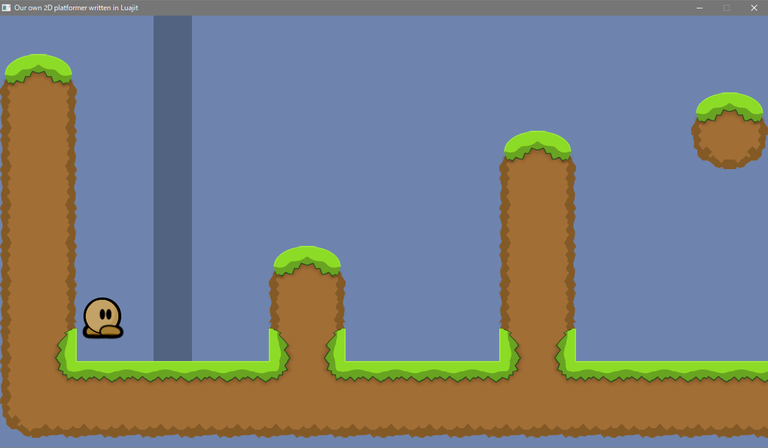

### luajit-platformer

---

Writing a 2D Platform Game in LuaJIT with SDL2.

This repository has been inherited from  
- Github - Source code  
[nim-platformer](https://github.com/def-/nim-platformer) project.
- English  
https://hookrace.net/blog/writing-a-2d-platform-game-in-nim-with-sdl2/  
- Japanese  
https://postd.cc/writing-a-2d-platform-game-in-nim-with-sdl2/  




#### Support OS

---

Windows10 

#### Install and run

---

```sh
git clone --recursive https://github.com/dinau/luajit-platformer
cd tutorial
r.bat 5          --- Example, execute platformer_part5.lua
```

#### Tutorial

---

- Key operation 

   | Key   | function |
   | :---: | :---     |
   | Space | Jump     |
   | A     | Left     |
   | D     | Right    |
   | R     | Restart  |
   | Q     | Quit     |

- Sources  
[platformer_part1.lua](tutorial/platformer_part1.lua)  
[platformer_part2.lua](tutorial/platformer_part2.lua)  
[platformer_part3.lua](tutorial/platformer_part3.lua)  
[platformer_part4.lua](tutorial/platformer_part4.lua)  
[platformer_part5.lua](tutorial/platformer_part5.lua) (2023/12) It can move a item with key input.  
[platformer_part6.lua](tutorial/platformer_part6.lua)  

- In progress  
~~platformer_part7.lua  
platformer_part8.lua  
platformer_part9.lua~~

#### Reference

---

- SDL2.dll  
https://github.com/libsdl-org/SDL/releases/
- SDL2_image.dll  
https://github.com/libsdl-org/SDL_image/releases
- LuaJIT-SDL2  
https://github.com/sonoro1234/LuaJIT-SDL2
