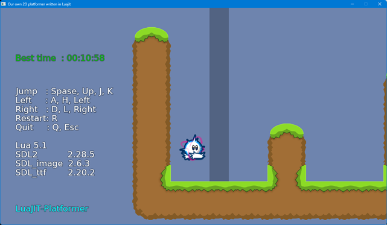

<!-- START doctoc generated TOC please keep comment here to allow auto update -->
<!-- DON'T EDIT THIS SECTION, INSTEAD RE-RUN doctoc TO UPDATE -->

- [LuaJIT-Platformer](#luajit-platformer)
  - [Support OS](#support-os)
  - [Download](#download)
  - [Run Tutorials](#run-tutorials)
  - [Install and run from sources](#install-and-run-from-sources)
  - [Reference](#reference)
  - [Tools version](#tools-version)

<!-- END doctoc generated TOC please keep comment here to allow auto update -->

### LuaJIT-Platformer

---

Writing a 2D Platform Game in LuaJIT with SDL2.

This repository has been inherited from [nim-platformer](https://github.com/def-/nim-platformer) project.
- Document  
English:  https://hookrace.net/blog/writing-a-2d-platform-game-in-nim-with-sdl2/  
Japanese: https://postd.cc/writing-a-2d-platform-game-in-nim-with-sdl2/  

Skin database [https://ddnet.org/skins](https://ddnet.org/skins)



#### Support OS

---

Windows10 or later


#### Download

---

- Latest for Windows 32bit / 64bit common  
   2024/11: [luajit-platformer-0.8.5.zip](https://bitbucket.org/dinau/storage/downloads/luajit-platformer-0.8.5.zip)  
   - old version  
   2024/11: [luajit-platformer-0.8.4.zip](https://bitbucket.org/dinau/storage/downloads/luajit-platformer-0.8.4.zip)

~~- Windows 64bit version in progress   
2024/11: luajit-platformer-0.9.0.zip~~

#### Run Tutorials

---

1. Unzip downloaded file
1. On MS-DOS command line, 

   ```sh
   cd luajit-paltformer-0.8.5 
   cd tutorial
   platformer_part5.bat      # For instance execute platformer_part5.lua
   ```

- Key operation  

   | Key            | function |
   | :---:          | :---     |
   | Up,Space, J, K | Jump     |
   | Left, A, H     | Left     |
   | Right, D, L    | Right    |
   | R              | Restart  |
   | Q              | Quit     |

- Tutorial sources  
[platformer_part1.lua](tutorial/platformer_part1.lua)  
[platformer_part2.lua](tutorial/platformer_part2.lua)  
[platformer_part3.lua](tutorial/platformer_part3.lua)  
[platformer_part4.lua](tutorial/platformer_part4.lua)  
[platformer_part5.lua](tutorial/platformer_part5.lua) (2023/12) From here it can move the item with key operation.  
[platformer_part6.lua](tutorial/platformer_part6.lua)  
[platformer_part7.lua](tutorial/platformer_part7.lua)  
[platformer_part8.lua](tutorial/platformer_part8.lua)  
platformer_part9.lua - In progress TODO  


#### Install and run from sources

---

```sh
git clone --recursive https://github.com/dinau/luajit-platformer
cd tutorial
... same above
```

#### Reference

---

| Dll            | URL                                                                |
|:---------------|:-------------------------------------------------------------------|
| SDL2.dll       | https://github.com/libsdl-org/SDL/releases/tag/release-2.28.5      |
| SDL2_image.dll | https://github.com/libsdl-org/SDL_image/releases/tag/release-2.6.3 |
| SDL2_ttf.dll   | https://github.com/libsdl-org/SDL_ttf/releases/tag/release-2.20.2  |
| LuaJIT-SDL2    | https://github.com/sonoro1234/LuaJIT-SDL2                          |


#### Tools version

---

- LuaJIT 2.1.1697887905 -- Copyright (C) 2005-2023 Mike Pall.
- SDL2 v2.28.5
- SDL2_image v2.6.3
- SDL2_ttf v2.20.2
- gcc.exe (Rev2, Built by MSYS2 project) 13.2.0
